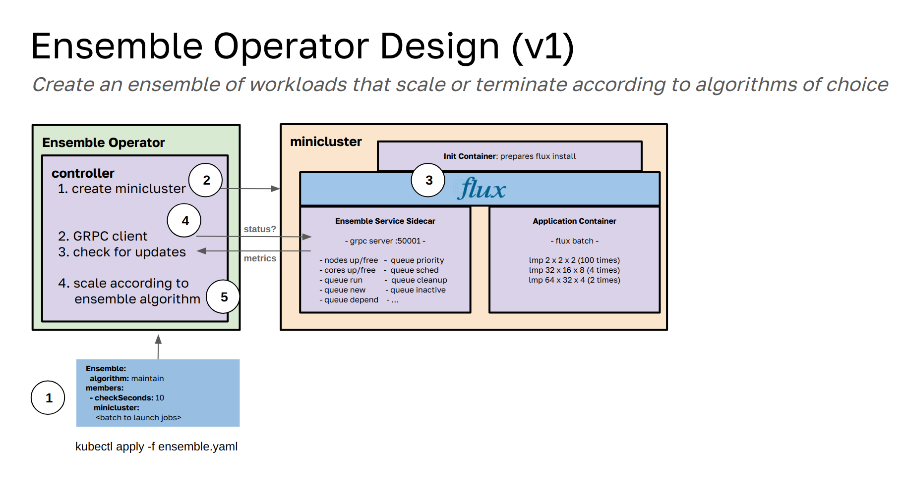

# The Ensemble Operator

This operator deploys ensembles of HPC applications, first with just Flux Framework, but eventually to include other CRDs. It uses [ensemble-python](https://github.com/converged-computing/ensemble-python) to orchestrate each ensemblem, and the operator is only pinged for update requests to grow or otherwise change the ensemble member.

See [docs](docs) for the user guide, and description of the [design](docs/design.md) above. Previously we had algorithms, and now the design is more flexible to accept a set of jobs that are governed by rules (triggers and actions) akin to a state machine. These rules in and of themselves make up a custom algorithm for the work that you want to be done. 

## License

HPCIC DevTools is distributed under the terms of the MIT license.
All new contributions must be made under this license.

See [LICENSE](https://github.com/converged-computing/cloud-select/blob/main/LICENSE),
[COPYRIGHT](https://github.com/converged-computing/cloud-select/blob/main/COPYRIGHT), and
[NOTICE](https://github.com/converged-computing/cloud-select/blob/main/NOTICE) for details.

SPDX-License-Identifier: (MIT)

LLNL-CODE- 842614
