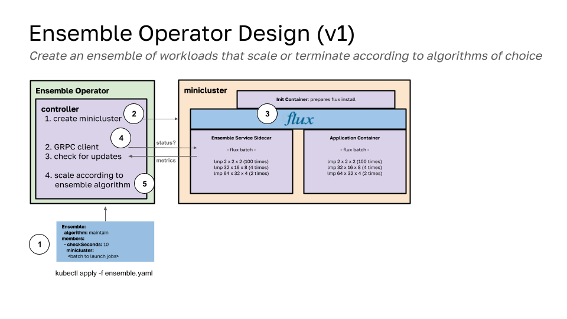

# The Ensemble Operator

This operator will deploy ensembles of HPC applications, first with just Flux Framework, but eventually to include other CRDs. You can select an algorithm to use across your ensemble, or within a specific member.

See [docs](docs) for the user guide, description of the [design](docs/design.md) above, and [algorithms](https://github.com/converged-computing/ensemble-operator/blob/main/docs/algorithms.md#algorithms) for our planned work in that space. We currently have the GRPC service endpoint and client (in the operator) working, and a regular check for the flux queue status, and just need to implement algorithms now that make sense. Note that due to the active role in the lifecycle of an ensemble member, this operator is intended to be running (relatively speaking) a smaller number of jobs, and having most of the work being done within the member.

## TODO

 - we need a "cooldown" strategy for scaling. With a CRD update, reconcile happens immediately, and the queue is likely to report it still needs scaling.
 - think about an experiment we could do, or should add other algorithms first?
 - Think about idea of shared jobs matrix that can go between members (advanced)

## License

HPCIC DevTools is distributed under the terms of the MIT license.
All new contributions must be made under this license.

See [LICENSE](https://github.com/converged-computing/cloud-select/blob/main/LICENSE),
[COPYRIGHT](https://github.com/converged-computing/cloud-select/blob/main/COPYRIGHT), and
[NOTICE](https://github.com/converged-computing/cloud-select/blob/main/NOTICE) for details.

SPDX-License-Identifier: (MIT)

LLNL-CODE- 842614
