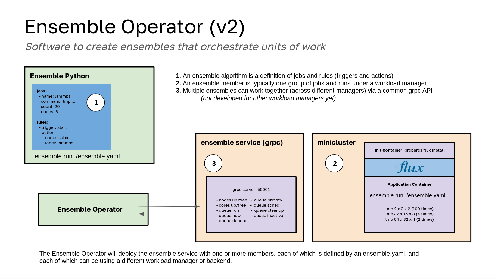

# Design

The ensemble operator orchestrates ensembles of jobs based on events and state machine logic. This means that you define a set of work (jobs) and rules (triggers and actions) for how to act. It is a state machine because there is no DAG calculated in advance. The rules are combined with events delivered from ensemble members, which can range from an entire HPC cluster on premises or in Kubernetes to other Kubernetes abstractions like JobSet (coming soon). Generally speaking, triggers can be anything from metrics collected about the queue for a job group (typicalling streaming models of ML) to expected job events. Custom rules that return actions of your choosing can also be written that take into account anything you can implement in Python. There are a lot of details, and the [ensemble python README](https://github.com/converged-computing/ensemble-python?tab=readme-ov-file#design) is the best place to read about the details. The remainder of the design document here will focus on the Ensemble Operator, which primarily serves to run ensemble-python in the Kubernetes space, providing actions "grow" and "shrink" that do not work (yet) on traditional HPC.

## Current Design

This current design moves the responsibility to service one or more ensembles from the operator to a GRPC deployment that runs alongside the members. It's a much better design to do that, and it also has a refactored [ensemble-python](https://github.com/converged-computing/ensemble-python) library that works external to the operator here (and Kubernetes in general) so you can run Ensembles alongside your workload manager a la carte!



In the above, an ensemble member (a Flux Framework MiniCluster) is deployed as a single member ensemble. The ensemble member will be running ensemble-python on the lead broker (index 0 of the indexed job), where it is installed on the fly, akin to how Flux is added to the application container on the fly. The ensemble follows the work (jobs) and rules that are defined in the user-provided ensemble.yaml file. The ensemble-python library provides a simple state machine that receives job events from flux, and also uses a heartbeat (at a user defined frequency) to look for changes in metric models that might warrant an action. As an example, a rule might say to grow the cluster if the pending time for a job group goes above a threshold. We need a heartbeat to check that. 

For Kubernetes logic, the ensemble service is a deployment that runs a GRPC service following the same protocol (gRPC) as ensemble python knows how to interact with. It can receive events from multiple ensemble members (not shown here) and eventually handle things like fair share, etc. A headless service was explicitly not chosen because ensemble members should not share a network. Rather, the GRPC service is provided via its own exposed ClusterIP that is provided to ensemble members. For the GRPC service to make changes to ensemble members (grow/shrink) it has a paired Role and Role Binding with a Service Account to control MiniClusters in the same namespace. This is a huge improvement on the first design (discussed below) because ensemble-python works outside of Kubernetes, and there is not a huge load on the operator to interact with ensemble members.

Note that while this is running in Kubernetes, it does not need to be - it works on "bare metal" Flux, but not all features can be supported. For features that are in the queue (see what I did there) please see the [ensemble-python](https://github.com/converged-computing/ensemble-python) README. Most development will happen there, as the operator doesn't need to do much aside from running it!

## Design 1

This was the first design. I found it problematic to put the interaction between the operator and ensemble in a sidecar to the MiniCluster, because it meant I could not easily add another member. I also found the frequency of communication between the ensemble member and operator problematic - there was too much expectation or burden on the operator to receive and respond to requests. Finally, I didn't like that the Python library (that orchestrated the ensemble) was tied specifically to the operator. I wanted the library to work outside of it.


## 1. Create an Ensemble

We start with the creation of an Ensemble (1). If you look in [examples](https://github.com/converged-computing/ensemble-operator/tree/main/examples/algorithms/workload/demand) you will see one for lammps. An ensemble custom resource definition allows you to define the specification for an entire Flux MiniCluster, meaning that (when run in batch) it is going to kick off launching a bunch of jobs to the queue, and likely they will stack up (meaning the queue will be full). This is why we use the 🥞️ emoji freely - ensembles are like pancakes! Note that you can create more than one MiniCluster per ensemble, and this is intending to support being able to run ensembles on different resources. We also intend to support other types of operators (or Kubernetes abstractions) such as a JobSet, and each will likely have a different strategy for the scaling (for example, the Flux queue can be shared with a sidecar, and other abstractions don't even have queues, so likely we will just be twewaking the CRD definitions themselves). More on that later.

## 2. Create Ensemble Member

Each entry you define in the ensemble (right not, just MiniCluster) is called a Member. Logically, the first step of the operator
is to create the member, and wait until this resource is ready. This means that for the case of the Flux Operator, you need to have it installed in the cluster. The Flux Operator handles the creation, although because it's created _by_ the Ensemble operator, we technically own it. It's pretty neat how that works. :)

## 3. Flux Operator Logic

While explaining the Flux Operator is out of scope for here, I thought I would so it's clear why this works. The Flux Operator uses an init container (with a view of Flux) to dynamically add this entire Flux install to a shared empty directory volume. This means that any other container that connects to the volume can use Flux. It also means that if two containers are connected to the same empty directory, they both can interact with the _same_ Flux install and socket, meaning the same queue. This is immenesely important for our design! What the operator does is add a sidecar container to run alongside your application (e.g., LAMMPS) and
it has ready to go the Python server definition for the same GRPC that the operator is going to be a client for. This means that we can start the main application to launch jobs onto the queue, but then also start the sidecar GRPC service. We use the same exact Python install and Flux socket (in the shared view) and then expose the entire queue from the service. In layman's terms, the pod ip address provides an endpoint that will return a JSON dump of both queue and node metrics.  It's largely up to you, the user, how you want to submit jobs, or even if you want to have custom logic within your batch script to do that. There is a lot of cool stuff we can try.

## 4. GRPC Client to Ask for Updates

Once the MiniCluster is up and running (and the operator continues reconciling until it has an ip address to connect to associated with the pod, this works based on a selector for the job and the exact index that has the lead broker) we can create a GRPC client
from inside of the operator. It pings the sidecar container and asks for a status. The sidecar promptly delivers what it knows, the custom Python functions it has to show queue and node stats. The data looks like this:

```json
{
    "nodes": {
        "node_cores_free": 10,
        "node_cores_up": 10,
        "node_up_count": 1,
        "node_free_count": 1
    },
    "queue": {
        "new": 0,
        "depend": 0,
        "priority": 0,
        "sched": 0,
        "run": 0,
        "cleanup": 0,
        "inactive": 0
    }
}
```

Note that this set of metadata provided can easily be expanded. These were the easy things to grab.

## 5. Algorithms

At this point, the user will have started the ensemble with some algorithm (an interface we have not implemented yet) and the operator will take the queue and node data, combine that with the user preference, and take an action. An algorithm should know under
what conditions to do the following:

- when to stop a MiniCluster (e.g., when is it done? Some other failure state condition?)
- when to scale up
- when to scale down
- when to ask for more jobs

For the last bullet, remember that we are connected to the running flux broker. We can easily define a set of commands in the specification for the algorithm, and then have some condition under which (in the response to the GRPC server running in the sidecar) we actually tell it to do something. For example, if we are running simulations and the queue is empty? We would send that information back to the operator, and the operator would see that it's algorithm instructs to submit more jobs when that happens, and it would send this signal back. The thing that is so cool about this is that there is really no limit to what we can do - we just need to decide. Likely the sidecar gRPC server can provide optional endpoints that provide functionality to interact with Flux in any way you can imagine (submit, save, start a new broker, something else?) and then the algorithm can decide which of those functions to use when it returns the response to a status request.

And yes, this does start to tip toe into state machine territory, we probably don't want to make it too complicated.

Finally, we can bring a cluster autoscaler into the picture. The _cluster_ autoscaler has a concept of [expanders](https://github.com/kubernetes/autoscaler/tree/master/cluster-autoscaler/expander) that can be tied to request nodes for specific pools. Since operators can easily serve scale endpoints, we likely can find a way to coordinate the MiniCluster scale request with the actual cluster scaling. If we have different node pools for different MiniCluster then it would be easy to assign based on expanders, but otherwise we will need to think. Likely there is a way and we just need to try it out. TLDR: The more advanced setup of this operator will also have a cluster autoscaler.

This is wicked! This is definitely my favorite under 24 hour operator I've produced. It's really cool 😎️
